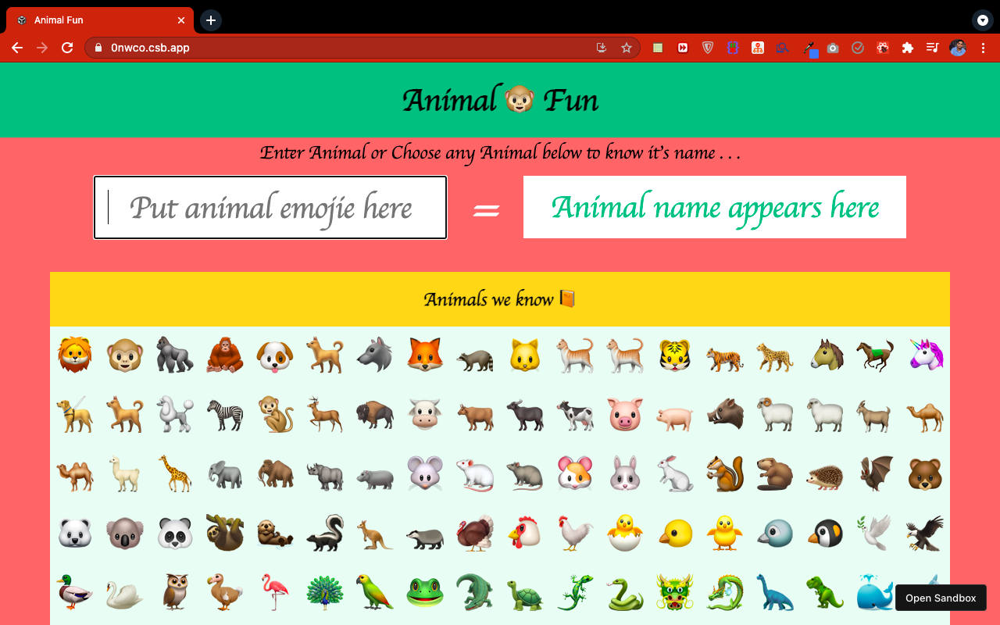

# Fun Animal : An Emojie Story 🦧

This is a website made with ❤️ and React JS . The concept of functional components , react hooks and useState has been implemented here . This allows you to play with fantastic animal emojies and know the names of animals by inputing emojie and even by clicking the emojie . 
This is the submission for neogcamp Mark 8. 📙 

You can see live demo by visiting below link -
https://0nwco.csb.app/

And I know this images looks a bit streched but remember man is also an animal ...😋

